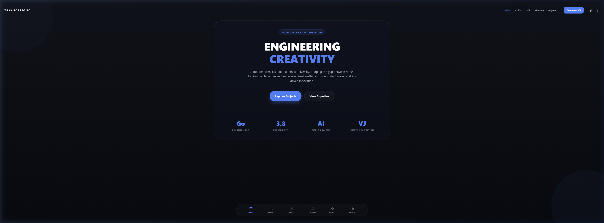
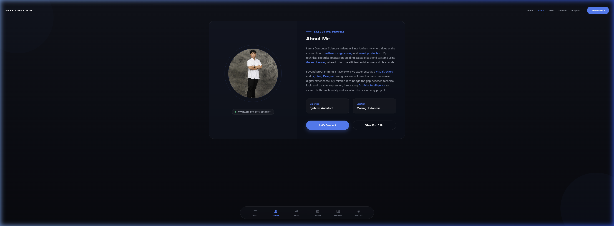
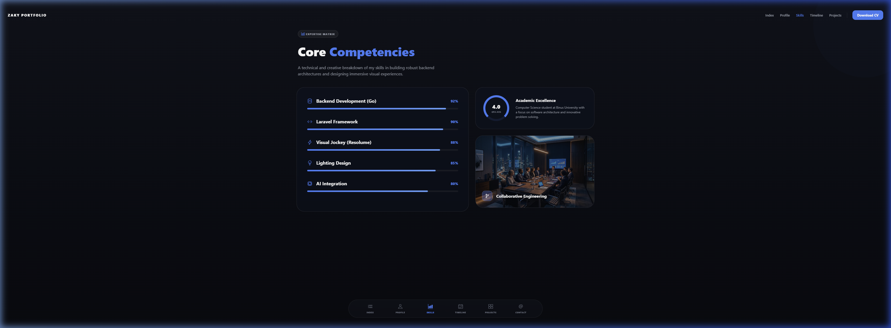
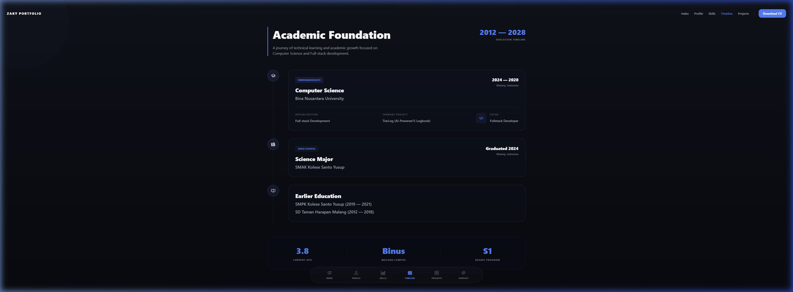
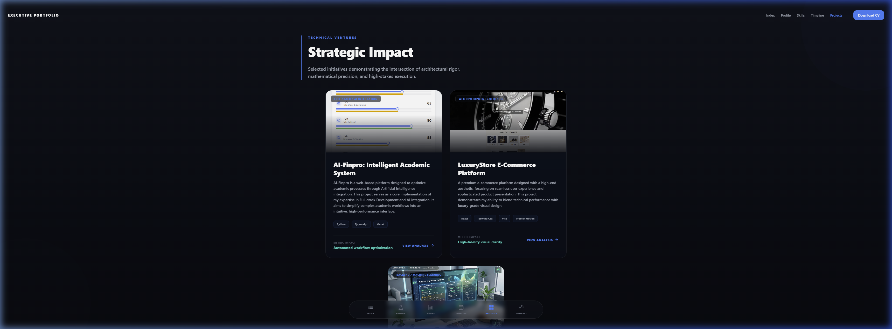
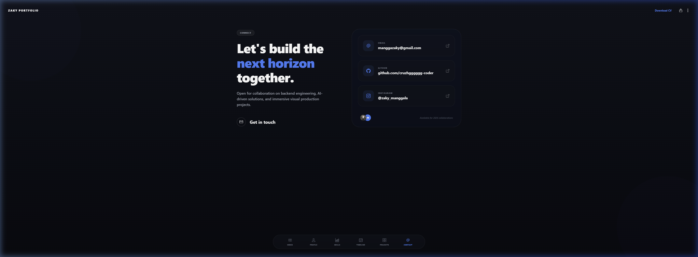

# ZAKY PORTFOLIO - Creative Engineering & Visual Production

## 📸 Screen Previews

| Home | Profile |
| :---: | :---: |
|  |  |

| Skills | Academic Timeline |
| :---: | :---: |
|  |  |

| Projects | Contact |
| :---: | :---: |
|  |  |

Welcome to the professional portfolio of **Zaky Manggala**, a Computer Science student at Binus University specializing in Backend Engineering, AI Innovation, and Immersive Visual Production.


This project is built using **React Native (Expo)** with a focus on high-end aesthetics, glassmorphism, and responsive layouts.

## 🚀 Overview

Bridging the gap between robust technical architecture and creative visual expression. This portfolio showcases projects ranging from AI-driven financial analysis to immersive visual designs for live productions.

### Key Sections:
- **Index**: Strategic overview and mission statement.
- **Profile**: Detailed background, philosophy, and professional goals.
- **Skills**: Expertise in Go, Laravel, React, and Visual Production tools.
- **Academic**: Educational timeline and academic achievements.
- **Projects**: Showcase of key engineering and creative works.
- **Contact**: Direct channels for collaboration.

## 🛠️ Tech Stack

- **Framework**: [Expo](https://expo.dev) (React Native for Web)
- **Routing**: [Expo Router](https://docs.expo.dev/router/introduction) (File-based)
- **UI/UX**:
  - Glassmorphism Design
  - `expo-blur` for frosted glass effects
  - `expo-linear-gradient` for premium color transitions
- **Icons**: [Ionicons (@expo/vector-icons)](https://icons.expo.fyi/)
- **Styling**: Standardized `StyleSheet` with responsive factory patterns.

## 📱 Features

- **Responsive Layout**: Optimized for Mobile, Tablet, and Desktop viewports.
- **Interactive UI**: Hover effects, smooth navigation, and clickable contact links.
- **Performance**: Lightweight and fast-loading static architecture.
- **Modern Aesthetic**: Dark mode primary theme with vibrant blue accents.

## 🏁 Getting Started

### Prerequisites
- [Node.js](https://nodejs.org/)
- [npm](https://www.npmjs.com/) or [yarn](https://yarnpkg.com/)

### Installation

1. Clone the repository:
   ```bash
   git clone https://github.com/cruzhgggggg-coder/Portofolio_React.git
   ```

2. Navigate to the project directory:
   ```bash
   cd Portofolio_React/porto
   ```

3. Install dependencies:
   ```bash
   npm install
   ```

4. Start the development server:
   ```bash
   npx expo start
   ```

## 📂 Project Structure

```text
porto/
├── app/                # Main screens (Index, Profile, Skills, Academic, Project, Contact)
├── assets/             # Images and local resources
├── components/         # Reusable UI components
├── constants/          # App constants and colors
└── hooks/              # Custom React hooks
```

## ✉️ Contact

- **Email**: manggazaky@gmail.com
- **Instagram**: [@zaky_manggala](https://instagram.com/zaky_manggala)
- **GitHub**: [cruzhgggggg-coder](https://github.com/cruzhgggggg-coder)

---

Developed with ❤️ by **Zaky Manggala**
